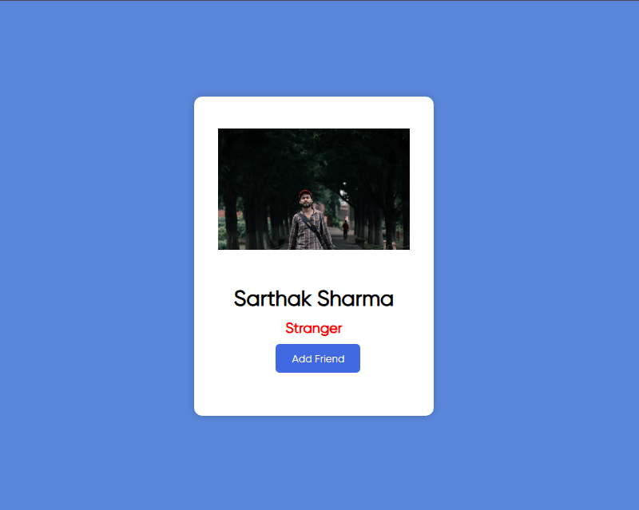
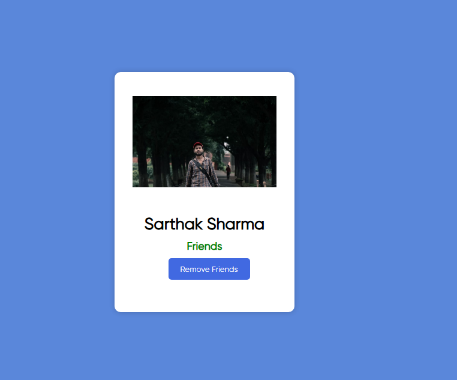

# friend-toggle-ui
A simple interactive UI component built using HTML, CSS, and JavaScript that simulates sending and removing friend requests. This mini project dynamically updates the relationship status between "Stranger" and "Friends" when the "Add Friend" or "Remove Friend" button is clicked.

# Friend Toggle UI

This is a small practice project built using **HTML**, **CSS**, and **JavaScript**. It demonstrates how to dynamically update UI elements based on user interaction — simulating a friend request system.

## 🔧 Features

- Displays "Stranger" as the default relationship status.
- Clicking **"Add Friend"** updates status to **"Friends"** and changes button to **"Remove Friend"**.
- Clicking **"Remove Friend"** reverts the status back to **"Stranger"** and button to **"Add Friend"**.
- Fully functional without any backend — ideal for JavaScript DOM manipulation practice.

## 📷 Demo




## 🚀 Technologies Used

- HTML5
- CSS3
- JavaScript (Vanilla)

## 💡 How to Use

1. Clone the repository:

```bash
git clone https://github.com/RoshanKumarJha18/friend-toggle-ui.git
